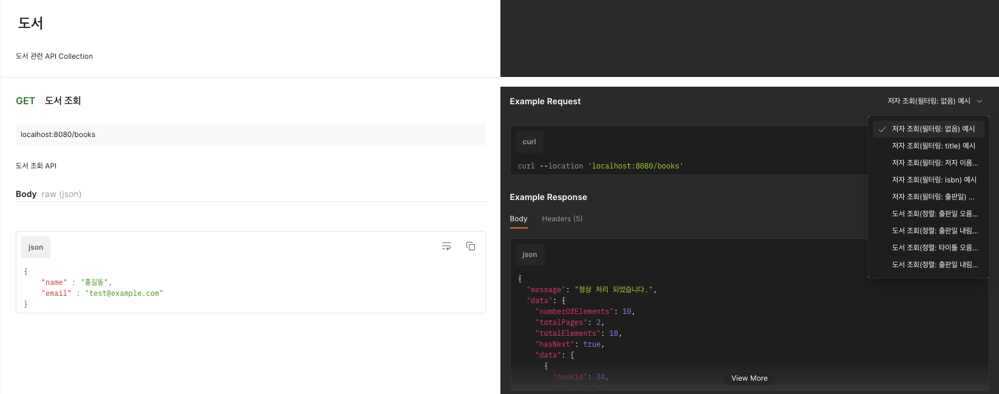

# book-management-system

## 저자 & 도서 삭제 관련
저자 삭제 시 Soft Delete로 삭제됩니다.  
해당 저자의 도서 또한 Soft Delete로 DB에서 관리됩니다. 
삭제 시 저자 이메일, 도서 isbn은 UUID로 초기화 됩니다.

## 설치 및 실행 방법
1. 폴더 생성(윈도우), 디렉토리 생성(macOS)
2. git clone https://github.com/HanYoonSoo/book-management.git 명령어 수행
3. cd book-management
4. chmod u+x gradlew
5. ./gradlew bootRun

## API 사용 예시 작성

Postman API 사용 예시 경로: https://documenter.getpostman.com/view/40121693/2sAYdhHpg2

## Swagger 문서 접근 방법

실행 방법 대로 실행 시킨 이후, 아래 경로로 접속 
Swagger 접속 경로: http://localhost:8080/swagger-ui/index.html#

## 기타 주의 사항
애플리케이션 포트(8080)이 이미 실행중인 경우 프로젝트가 정상적으로 실행되지 않을 수 있습니다. 
git이 설치되어 있는 환경이어야 합니다. 
Java가 설치되어 있는 환경이어야 합니다. 

